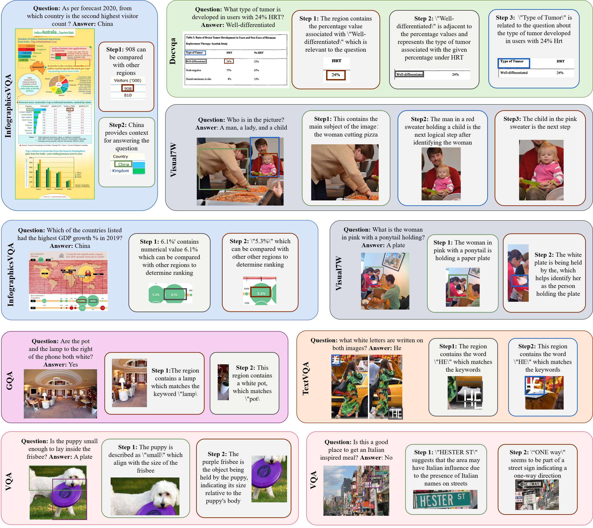

# CoCoT_70K: Collaborative Cross-modal Chain-of-Thought Dataset

## Brief Intro, Welcome :-)

This is the implementation of our work: "**Watch Wider and Think Deeper: Collaborative Cross-modal Chain-of-Thought for Complex Visual Reasoning**" which is accepted by NIPS 2025 workshop. 

In this work we generated **74,691** complex question-answer pairs including multiple bounding boxes and chain of thought, among 6 general datasets. Specifically, we selected some complex questions, cited bounding boxes which may help answering the question, and use an iterative approach to organize them to form a chain of thought for each question. Our dataset achieving an average accuracy improvement of 15.4% on LLaVA-1.5 and 4.0% on Qwen2-VL during inference process. 

 


Our file structure is as follows

```
CoCoT/
├── 🔧 Core Scripts
│   ├── generate_bbox_one_agent_qwen.py    # Main script: generates bbox data
│   └── generate_relation_cycle.py         # Main script: generates reasoning chain data

├── 📖 Documentation & Configuration
│   ├── README.md                          
│   ├── requirements.txt                   # Pip dependency list
│   ├── current_requirements.txt           # Current environment complete package list
│   ├── environment.yml                    # Conda environment configuration
│   ├── Dockerfile                         # Docker image configuration
│   └── docker-compose.yml                # Docker orchestration configuration

├── 🤖 Model Files
│   └── Qwen2-VL-7B-Instruct/             # Qwen2-VL model files

├── 📊 Datasets
│   ├── dataset_with_GT/                   # Original datasets (with Ground Truth)
│   │   ├── Docvqa/DocVQA_complex_4plus.json                       # DocVQA dataset
│   │   ├── GQA/GQA_merged_complex_6plus.json                      # GQA dataset
│   │   ├── InfoVQA/InfoVQA_complex_4plus_parallel.json            # InfoVQA dataset
│   │   ├── TextVQA/TextVQA_complex_3plus_parallel.json           # TextVQA dataset
│   │   ├── VQAv2/VQA_v2_train_merged.json                        # VQAv2 dataset
│   │   └── Visual7W/Visual7W_complex_3plus_parallel.json        # Visual7W dataset
│   └── playground/                        # Data storage directory
│       └── data/                         # Various intermediate and final data
│           └── cot/                      # Image data categorized by dataset
│              ├── docvqa/ffbf0023_4.png...              # DocVQA images
│              ├── gqa/1.jpg...                            # GQA images
│              ├── textvqa/0a0bc91825468c45.jpg...             # TextVQA images
│              ├── coco/COCO_train2014_000000000009.jpg...       # COCO images (VQAv2)
│              ├── v7w/v7w_1.jpg...                 # Visual7W images
│              └── infographicsvqa/10002.jpeg...    # InfoVQA images
│          
├── 📦 Generated Results
│   ├── images_bbox/                       # Generated bbox data
│   │   ├── DocVQA_complex_one_agent.json
│   │   ├── GQA_complex_one_agent.json
│   │   ├── InfoVQA_complex_one_agent.json
│   │   ├── TextVQA_complex_one_agent.json
│   │   ├── VQAv2_complex_one_agent.json
│   │   └── Visual7W_complex_one_agent.json
│   └── reasoning_chains/                  # Generated reasoning chain data
│       ├── DocVQA_complex_reasoning_chains_one_agent.json
│       ├── GQA_complex_reasoning_chains_one_agent.json
│       ├── InfoVQA_complex_reasoning_chains_one_agent.json
│       ├── TextVQA_complex_reasoning_chains_one_agent.json
│       ├── VQAv2_complex_reasoning_chains_one_agent.json
└──     └── Visual7W_complex_reasoning_chains_one_agent.json    
```


## Data selection

We applied two criteria to filter out complex questions (which need more than one bounding box to answer them): (1) questions containing
multiple keywords (thresholds varying by dataset from >3 to >6 keywords) and (2) answers requiring
compositional reasoning (containing conjunctions or multiple elements). The data we selected is located at folder`dataset_with_GT`.

| Dataset                                  | Samples | Filter Criteria                      | Multi Region Ratio | Source Files                                                 |
| ---------------------------------------- | ------- | ------------------------------------ | ------------------ | ------------------------------------------------------------ |
| GQA [[1]](#hudson2019gqa)                | 9,740   | Keywords > 6                         | 41.4%              | `GQA_val_balanced.json`<br>`GQA_val_all.json`<br>`GQA_train_balanced.json` |
| DocVQA [[2]](#mathew2021docvqa)          | 10,650  | Keywords > 4 or answers with ",/and" | 18.1%              | `docvqa_train_reordered.jsonl`<br>`docvqa_train_v1.0_reordered.json` |
| InfoVQA [[3]](#mathew2022infographicvqa) | 14,421  | Keywords > 4 or parallel answers     | 39.1%              | `infographicVQA_train_v1.0.json`<br>`infographicVQA_val_v1.0.json` |
| TextVQA [[4]](#singh2019towards)         | 8,205   | Keywords > 3 or conjunction answers  | 31.2%              | `TextVQA_train.json`                                         |
| Visual7W [[5]](#zhu2016visual7w)         | 15,675  | Keywords > 3 or multi-part answers   | 51.5%              | `Visual7W_telling.json`                                      |
| VQAv2 [[6]](#goyal2017making)            | 16,270  | Keywords > 5 or compound answers     | 54.5%              | `VQA_v2_train.json`                                          |


## Setup

### Download Image & Model

Firstly, you have to download images and configure them in the paths under `playground/data/cot`

- **COCO**: [images](http://images.cocodataset.org/zips/train2014.zip) (82,783 images)
- **DocVQA**: [homepage](https://www.docvqa.org/datasets/docvqa) (10,196 images)
- **TextVQA**: [images](https://dl.fbaipublicfiles.com/textvqa/images/train_val_images.zip) (25,119 images)
- **Visual7W**: [repo](https://github.com/yukezhu/visual7w-toolkit) (47,300 images)
- **GQA**: [images](https://downloads.cs.stanford.edu/nlp/data/gqa/images.zip) (148,854 images)
- **InfographicVQA**: [homepage](https://www.docvqa.org/datasets/infographicvqa) (5,485 images)

```
playground/                        # Data storage directory
│       └── data/                         # Various intermediate and final data
│           └── cot/                      # Image data categorized by dataset
│              ├── docvqa/ffbf0023_4.png...              # DocVQA images
│              ├── gqa/1.jpg...                            # GQA images
│              ├── textvqa/0a0bc91825468c45.jpg...             # TextVQA images
│              ├── coco/COCO_train2014_000000000009.jpg...       # COCO images (VQAv2)
│              ├── v7w/v7w_1.jpg...                 # Visual7W images
│              └── infographicsvqa/10002.jpeg...    # InfoVQA images
│          
```

Also, qwen2-VL-7B model should be downloaded to path `Qwen2-VL-7B-Instruct` which will be used to generate bounding boxes and chain of thought. 

### Environment Setup

You can easily setup environment by these command, also we provided docker and .yml files.

```bash
# 1. Create base environment
conda create -n qwen2vl python=3.9 -y
conda activate qwen2vl

# 2. Install PyTorch (choose based on your CUDA version)
# CUDA 12.6 (current environment)
pip install torch torchvision torchaudio --index-url https://download.pytorch.org/whl/cu121 

# 3. Install other dependencies
pip install -r requirements.txt
```


## Generate multiple bounding boxes

Just using `python generate_bbox_one_agent_qwen.py` to generate boxes with details under `images_bbox` folder.  To better match regions of interest we applied ROC to enhance the boxes generation. 

```json
{
  "question_id": "DocVQA_338",                    // Unique question ID
  "question": "what is the contact person name mentioned in letter?",
  "image_name": "xnbl0037_1",                    // Image filename (without extension)
  "answers": ["P. Carter", "p. carter"],         // Standard answer list
  "bbox_analysis": {
    "relevant_elements": [                       // Relevant regions list
      {
        "description": "Contact person name",   // Region description
        "bbox": [0.33, 0.31, 0.41, 0.34],     // Normalized coordinates [x1,y1,x2,y2]
        "selection_reason": "Contains the contact person information",
        "content_relation": "This region shows the name P.CARTER which directly answers the question"
      }
    ],
    "generation_method": "hybrid_qwen2vl_ocr",   // Generation method
    "generation_layer": 1,                       // Generation layer (1-4)
    "generation_description": "Generated by hybrid method: Qwen2-VL + OCR precise localization"
  }
}
```

**Layer 1** means that we generate boxes and correct them by ROC successfully.

- Example:

  ```json
  {
    "generation_method": "hybrid_qwen2vl_ocr",
    "generation_layer": 1,
    "bbox": [0.245, 0.156, 0.387, 0.189],  // Precise text boundaries
    "match_info": {
      "ocr_confidence": 0.95,
      "text_match_score": 0.87
    }
  }
  ```

**Layer 2** means that qwen generates valid boxes but can't be matched to ROC region, this condition always happens in general image datasets which even don't have ROC data, likes gqa.  

- Example:

  ```json
  {
    "generation_method": "qwen2vl_only",
    "generation_layer": 2,
    "bbox": [0.1, 0.2, 0.4, 0.6],  // Visual region boundaries
    "description": "Chart showing sales data"
  }
  ```

**Layer 3** is designed to prevent from qwen failed condition. If qwen failed to generate valid box, we will parse question and use OCR to find relevant regions.  

- Example:

  ```json
  {
    "generation_method": "emergency_ocr",
    "generation_layer": 3,
    "bbox": [0.3, 0.4, 0.5, 0.45],
    "relevance": "Contains keyword 'total' relevant to the question"
  }
  ```

**Layer 4** is used as a fallback, just generate three fixed boxes to ensure that answer is not empty

- Example:

  ```json
  {
    "generation_method": "basic_fallback",
    "generation_layer": 4,
    "bbox": [0.05, 0.1, 0.3, 0.15],  // Assumed position
    "content": "Text containing 'contact'"
  }
  ```

## Generate CoT

After boxes generation, run `python generate_relation_cycle.py` to generate chain of thought with order under `reasoning_chains` folder.  Our method select one box each step and generate reason, till it find enough to answer question. An example is shown as follow: 


```json
{
    "id": "Visual7W_4499",
    "image": [
      "v7w_1593232"
    ],
    "question": "Who is in the picture?",
    "reasoning_chain": {
      "chain_type": "sequential",
      "reasoning_steps": [
        {
          "step": 1,
          "bbox_index": 0,
          "bbox_content": "A woman in a beige sweater cutting pizza",
          "description": "A woman in a beige sweater cutting pizza",
          "generated_reasoning": "This contains the main subject of the image, which is the woman cutting pizza.",
          "role": "picture",
          "relationship_to_previous": "sequential",
          "qwen_analysis": "SELECTED_REGION: [ Region 0] \nROLE: picture\nREASONon: This contains the main subject of the image, which is the woman cutting pizza.\nRELrelationship: sequential",
          "bbox_coordinates": [
            0.0,
            0.19,
            0.51,
            0.8
          ]
        },
        {
          "step": 2,
          "bbox_index": 1,
          "bbox_content": "A man in a red sweater holding a child",
          "description": "A man in a red sweater holding a child",
          "generated_reasoning": "The region with the man in a red sweater holding a child is the next logical step after identifying the woman cutting pizza.",
          "role": "nextstep",
          "relationship_to_previous": "sequential",
          "qwen_analysis": "SELECTED_REGION: [ Region 1] \nROLE: nextstep\nREASONon: The region with the man in a red sweater holding a child is the next logical step after identifying the woman cutting pizza.\nRELATIONSHIP: sequential",
          "bbox_coordinates": [
            0.44,
            0.17,
            0.8,
            0.63
          ]
        },
        {
          "step": 3,
          "bbox_index": 3,
          "bbox_content": "A child in a pink sweater",
          "description": "A child in a pink sweater",
          "generated_reasoning": "The child in the pink sweater is the next logical step after identifying the woman cutting pizza and the man holding a child.",
          "role": "conclusion",
          "relationship_to_previous": "sequential",
          "qwen_analysis": "SELECTED_REGION: [ Region 3] \nROLE: conclusion\nREASONon: The child in the pink sweater is the next logical step after identifying the woman cutting pizza and the man holding a child.\nRELationship: sequential",
          "bbox_coordinates": [
            0.54,
            0.31,
            0.73,
            0.63
          ]
        }
      ],
      "total_steps": 3,
      "final_answer": "A woman in a beige sweater cutting pizza, a man in a red sweater holding a child, and a child in a pink sweater.",
      "keywords_used": {
        "keywords": [
          "picture"
        ],
        "numbers": [],
        "quoted_terms": [],
        "all_terms": [
          "picture"
        ]
      },
      "multi_round_analysis": true,
      "question_type": "sequential",
      "chain_text": "This contains the main subject of the image, which is the woman cutting pizza. -> The region with the man in a red sweater holding a child is the next logical step after identifying the woman cutting pizza. -> The child in the pink sweater is the next logical step after identifying the woman cutting pizza and the man holding a child.",
      "chain_format": "sequential",
      "reasoning_chain_description": "Question type: sequential, Chain: This contains the main subject of the image, which is the woman cutting pizza. -> The region with the man in a red sweater holding a child is the next logical step after identifying the woman cutting pizza. -> The child in the pink sweater is the next logical step after identifying the woman cutting pizza and the man holding a child."
    },
    "bbox_elements": [
      {
        "description": "A woman in a beige sweater cutting pizza",
        "selection_reason": "The woman is actively engaged in cutting pizza, which is a central activity in the image.",
        "content_relation": "The woman's action of cutting pizza is the main focus of the image.",
        "bbox": [
          0.0,
          0.19,
          0.51,
          0.8
        ]
      },
      {
        "description": "A man in a red sweater holding a child",
        "selection_reason": "The man is holding a child, which is a significant detail in the image.",
        "content_relation": "The man's interaction with the child adds a family dynamic to the scene.",
        "bbox": [
          0.44,
          0.17,
          0.8,
          0.63
        ]
      },
      {
        "description": "A person holding a plate",
        "selection_reason": "The person is holding a plate, which is relevant to the activity of eating pizza.",
        "content_relation": "The plate indicates that the pizza is being served and consumed.",
        "bbox": [
          0.65,
          0.54,
          0.95,
          0.8
        ]
      },
      {
        "description": "A child in a pink sweater",
        "selection_reason": "The child is wearing a pink sweater, which is a notable detail.",
        "content_relation": "The child's attire adds color and liveliness to the image.",
        "bbox": [
          0.54,
          0.31,
          0.73,
          0.63
        ]
      }
    ],
    "ground_truth_answers": [
      "A man, a lady, and a child."
    ],
    "stats": {
      "bbox_count": 4,
      "original_bbox_count": 4,
      "removed_bbox_count": 0,
      "data_cleaning_applied": true
    }
  },
```


## References

<a id="hudson2019gqa">[1]</a> Hudson, D. A., & Manning, C. D. (2019). GQA: A New Dataset for Real-World Visual Reasoning and Compositional Question Answering.

<a id="mathew2021docvqa">[2]</a> Mathew, M., Karatzas, D., & Jawahar, C. V. (2021). DocVQA: A Dataset for Document Visual Question Answering.

<a id="mathew2022infographicvqa">[3]</a> Mathew, M., et al. (2022). InfographicVQA: A Large-Scale Dataset for Infographic Visual Question Answering.

<a id="singh2019towards">[4]</a> Singh, A., et al. (2019). Towards VQA Models That Can Read.

<a id="zhu2016visual7w">[5]</a> Zhu, Y., et al. (2016). Visual7W: Grounded Question Answering in Images.

<a id="goyal2017making">[6]</a> Goyal, Y., et al. (2017). Making the V in VQA Matter: Elevating the Role of Image Understanding in Visual Question Answering.
